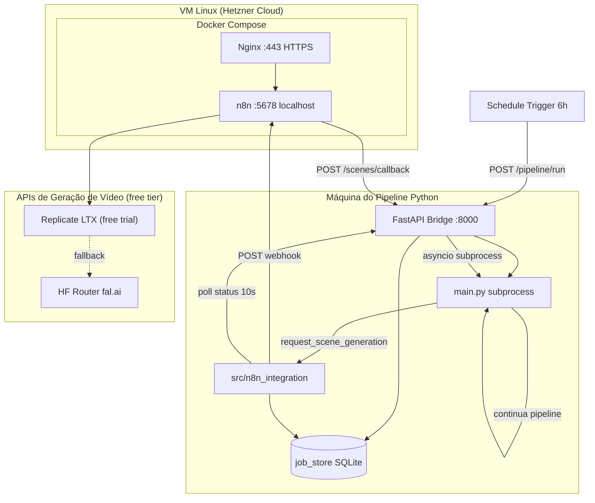

# Integração n8n — AI-Commerce-OS

Camada de integração que conecta o pipeline Python existente ao **n8n** hospedado em uma VM Linux (Hetzner Cloud). O n8n atua **apenas nas bordas** do sistema:

1. **Alimentador (Trigger)** — dispara o pipeline periodicamente via HTTP
2. **Orquestrador assíncrono de IA** — gerencia filas e fallback entre **Replicate (trial)** e **HF Router (fal.ai Wan2.2)**

O pipeline CLI (`python main.py ...`) continua funcionando **sem alterações**.

---

## Diagrama de Arquitetura



### Fluxo resumido

| Etapa | Componente | Ação |
|-------|-----------|------|
| 1 | n8n Schedule | POST `/api/v1/pipeline/run` |
| 2 | FastAPI | Enfileira job, executa `main.py` em subprocess |
| 3 | Pipeline Python | Chama `request_scene_generation()` |
| 4 | n8n Webhook | Orquestra Replicate LTX → HF Router (fal.ai) |
| 5 | n8n Callback | POST `/api/v1/scenes/callback` |
| 6 | scene_waiter | Polling até `video_path` disponível |
| 7 | Pipeline | Continua renderização FFmpeg (fallback Python se n8n falhar) |

---

## Setup Local (Windows — R$ 0, sem domínio)

Para desenvolvimento e testes no PC, sem VM nem domínio.

### Pré-requisitos

- [Docker Desktop](https://www.docker.com/products/docker-desktop/) instalado e rodando
- Python 3.10+

### 1. Subir n8n

```powershell
cd C:\Projetos\AI-Commerce-OS\infra
.\start-local.ps1
```

Ou manualmente:

```powershell
docker compose -f docker-compose.local.yml up -d
```

Acesse **http://localhost:5678** — login: `admin` + senha em `infra/.env.n8n`.

> Use `docker-compose.local.yml` (HTTP, sem nginx). O `docker-compose.yml` padrão é para produção com SSL.

### 2. Configurar `.env` (raiz do projeto)

Se ainda não existir:

```powershell
cd C:\Projetos\AI-Commerce-OS
copy .env.example .env
```

Preencha pelo menos:

```env
PIPELINE_API_KEY=<mesmo valor usado no n8n Header Auth>
N8N_WEBHOOK_SECRET=<mesmo valor de infra/.env.n8n>
N8N_SCENE_WEBHOOK_URL=http://localhost:5678/webhook/scene-generation
PIPELINE_API_BASE_URL=http://127.0.0.1:8000
```

Gere secrets no PowerShell:

```powershell
-join ((1..32) | ForEach-Object { '{0:x2}' -f (Get-Random -Max 256) })
```

### 3. Iniciar FastAPI

```powershell
cd C:\Projetos\AI-Commerce-OS
python -m venv venv
.\venv\Scripts\Activate.ps1
pip install -r requirements.txt
.\api\run_api.ps1
```

Teste: `curl http://127.0.0.1:8000/api/v1/health`

### 4. Importar workflows n8n

1. **Workflows → Import from file** — importe os JSON de `infra/n8n_workflows/`
2. Credencial **Pipeline API Key** → Header `X-API-Key` = valor de `PIPELINE_API_KEY`
3. Ative o workflow **01** → Execute workflow

### 5. Testar pipeline

```powershell
curl -X POST http://127.0.0.1:8000/api/v1/pipeline/run `
  -H "X-API-Key: SUA_PIPELINE_API_KEY" `
  -H "Content-Type: application/json" `
  -d '{\"platform\": \"youtube_dark\", \"topic\": \"teste local\"}'
```

### Túnel público temporário (opcional)

Se precisar expor localhost para webhooks externos:

```powershell
winget install Cloudflare.cloudflared
cloudflared tunnel --url http://localhost:5678
cloudflared tunnel --url http://127.0.0.1:8000
```

---

## Guia de Setup (Produção — Hetzner Cloud)

### Pré-requisitos

- VM **Hetzner Cloud** (CX22 ou superior) com Ubuntu 22.04+
- Domínio apontando para o IP público da VM (A record)
- Docker e Docker Compose v2 instalados
- Python 3.10+ na máquina que executa o pipeline
- Portas abertas no firewall da Hetzner (painel + UFW)

### 1. Abrir portas no firewall Hetzner

No painel **Firewalls** (ou UFW na VM via `setup_cloud_vm.sh`):

| Porta | Protocolo | Origem | Uso |
|-------|-----------|--------|-----|
| 22 | TCP | Seu IP | SSH |
| 80 | TCP | 0.0.0.0/0 | HTTP (Certbot + redirect) |
| 443 | TCP | 0.0.0.0/0 | HTTPS (Nginx → n8n) |

> A porta **5678** do n8n **não** deve ser exposta publicamente — apenas `127.0.0.1` no compose.

A porta **8000** da FastAPI fica na máquina do pipeline (pode ser a mesma VM ou outra). Se n8n e FastAPI estiverem na mesma VM, configure firewall interno ou exponha 8000 apenas para localhost/rede privada.

### 2. Configurar n8n na VM

```bash
cd infra
cp .env.n8n.example .env.n8n
# Edite .env.n8n com domínio, senhas e N8N_ENCRYPTION_KEY

# Obter certificado SSL (primeira vez)
docker compose --profile certbot run --rm certbot certonly \
  --webroot -w /var/www/certbot \
  -d n8n.seudominio.com \
  --email seu@email.com --agree-tos --no-eff-email

# Edite infra/nginx/n8n.conf substituindo n8n.seudominio.com

docker compose up -d
```

Verifique: `https://n8n.seudominio.com` (login com basic auth).

### 3. Configurar variáveis de ambiente

No **`.env` principal** do projeto (Python):

```bash
PIPELINE_API_KEY=sua_chave_secreta_aqui
PIPELINE_API_BASE_URL=http://127.0.0.1:8000
N8N_SCENE_WEBHOOK_URL=https://n8n.seudominio.com/webhook/scene-generation
N8N_WEBHOOK_SECRET=opcional_hmac_secret
N8N_SCENE_POLL_INTERVAL=10
N8N_SCENE_TIMEOUT=300
PIPELINE_API_RATE_LIMIT=60
PIPELINE_API_RATE_WINDOW=60
```

No **`infra/.env.n8n`** (n8n):

```bash
N8N_HOST=n8n.seudominio.com
WEBHOOK_URL=https://n8n.seudominio.com/
N8N_BASIC_AUTH_USER=admin
N8N_BASIC_AUTH_PASSWORD=senha_forte
N8N_ENCRYPTION_KEY=$(openssl rand -hex 32)
```

### 4. Instalar dependências Python

```bash
pip install fastapi "uvicorn[standard]" pydantic python-multipart httpx
```

Ou instale a partir do bloco `# === n8n Integration API ===` no `requirements.txt`.

### 5. Iniciar a FastAPI

```bash
chmod +x api/run_api.sh
./api/run_api.sh
```

Teste:

```bash
curl http://127.0.0.1:8000/api/v1/health
```

### 6. Importar workflows n8n

1. Acesse `https://n8n.seudominio.com`
2. **Workflows → Import from File**
3. Importe:
   - `infra/n8n_workflows/01_pipeline_trigger.json`
   - `infra/n8n_workflows/02_scene_generation_orchestrator.json`
4. Configure credenciais (criadas automaticamente por `python infra/setup_n8n.py` a partir do `.env`):
   - **Pipeline API Key** — `PIPELINE_API_KEY`
   - **Replicate API Token** — `REPLICATE_API_TOKEN` (Header `Authorization: Token …`)
   - **Hugging Face API Token** — `HF_API_TOKEN` (Header `Authorization: Bearer …`)
5. Ative ambos os workflows
6. Copie a URL do webhook do workflow 02 para `N8N_SCENE_WEBHOOK_URL`

### 7. Testar integração end-to-end

```bash
# Disparo manual do pipeline via API
curl -X POST http://127.0.0.1:8000/api/v1/pipeline/run \
  -H "X-API-Key: $PIPELINE_API_KEY" \
  -H "Content-Type: application/json" \
  -d '{"platform":"youtube_dark","production":false,"max_videos":1}'

# Consultar status
curl http://127.0.0.1:8000/api/v1/pipeline/status/{job_id} \
  -H "X-API-Key: $PIPELINE_API_KEY"
```

---

## Variáveis de Ambiente

### `.env` principal (Python / FastAPI / n8n_integration)

| Variável | Obrigatória | Descrição | Exemplo |
|----------|-------------|-----------|---------|
| `PIPELINE_API_KEY` | Sim | Chave de autenticação da FastAPI (header `X-API-Key`) | `abc123...` |
| `PIPELINE_API_BASE_URL` | Sim | URL base da FastAPI | `http://127.0.0.1:8000` |
| `N8N_CALLBACK_BASE_URL` | Não | URL da FastAPI **vista pelo n8n no Docker** (callback) | `http://host.docker.internal:8000` |
| `N8N_SCENE_WEBHOOK_URL` | Sim | Webhook n8n para geração de cenas | `https://n8n.example.com/webhook/scene-generation` |
| `N8N_WEBHOOK_SECRET` | Não | Secret HMAC enviado no header `X-Webhook-Secret` | `shared_secret` |
| `N8N_SCENE_POLL_INTERVAL` | Não | Intervalo de polling em segundos (padrão: 10) | `10` |
| `N8N_SCENE_TIMEOUT` | Não | Timeout de espera por cena em segundos (padrão: 300) | `300` |
| `PIPELINE_API_RATE_LIMIT` | Não | Máx. requisições por janela (padrão: 60) | `60` |
| `PIPELINE_API_RATE_WINDOW` | Não | Janela de rate limit em segundos (padrão: 60) | `60` |
| `API_HOST` | Não | Host do uvicorn (padrão: 0.0.0.0) | `0.0.0.0` |
| `API_PORT` | Não | Porta do uvicorn (padrão: 8000) | `8000` |
| `API_WORKERS` | Não | Workers uvicorn (padrão: 1) | `1` |

### `infra/.env.n8n` (Docker n8n)

| Variável | Obrigatória | Descrição | Exemplo |
|----------|-------------|-----------|---------|
| `N8N_HOST` | Sim | Domínio público do n8n | `n8n.example.com` |
| `WEBHOOK_URL` | Sim | URL base para webhooks gerados | `https://n8n.example.com/` |
| `N8N_BASIC_AUTH_ACTIVE` | Sim | Habilita basic auth no painel | `true` |
| `N8N_BASIC_AUTH_USER` | Sim | Usuário do painel n8n | `admin` |
| `N8N_BASIC_AUTH_PASSWORD` | Sim | Senha do painel n8n | `***` |
| `N8N_ENCRYPTION_KEY` | Sim | Chave de criptografia (32 bytes hex) | `openssl rand -hex 32` |
| `N8N_WEBHOOK_SECRET` | Não | Deve coincidir com `.env` Python | `shared_secret` |
| `GENERIC_TIMEZONE` | Não | Fuso horário | `America/Sao_Paulo` |
| `TZ` | Não | Timezone do container | `America/Sao_Paulo` |

---

## Estrutura de Arquivos Criados

```
infra/
├── docker-compose.yml
├── .env.n8n.example
├── nginx/n8n.conf
└── n8n_workflows/
    ├── 01_pipeline_trigger.json
    └── 02_scene_generation_orchestrator.json

api/
├── __init__.py
├── main_api.py
├── run_api.sh
├── routers/
│   ├── __init__.py
│   ├── pipeline.py
│   └── scenes.py
├── services/
│   ├── __init__.py
│   ├── pipeline_runner.py
│   └── job_store.py
└── models/
    ├── __init__.py
    └── schemas.py

src/n8n_integration/
├── __init__.py
├── config.py
├── scene_client.py
└── scene_waiter.py

docs/n8n_integration.md
```

---

## Troubleshooting

### n8n não inicia / healthcheck falha

- Verifique logs: `docker compose logs n8n`
- Confirme que `N8N_ENCRYPTION_KEY` está definido
- Em ARM64, a imagem `n8nio/n8n:latest` suporta multi-arch nativamente

### Webhook retorna 404

- Workflow 02 deve estar **ativo** no n8n
- Confirme `WEBHOOK_URL` em `infra/.env.n8n` aponta para HTTPS público
- URL do webhook muda se o path do nó Webhook for alterado

### FastAPI retorna 401 Unauthorized

- Header `X-API-Key` deve coincidir com `PIPELINE_API_KEY` no `.env`
- Reinicie uvicorn após alterar `.env`

### FastAPI retorna 503 — PIPELINE_API_KEY not configured

- Defina `PIPELINE_API_KEY` no `.env` antes de iniciar a API

### Pipeline subprocess falha (status: failed)

- Consulte `error_message` em GET `/api/v1/pipeline/status/{job_id}`
- Execute manualmente: `python main.py --platform youtube_dark` para isolar o erro
- Verifique que todas as API keys do pipeline original estão no `.env`

### Cena expira (TimeoutError no scene_waiter)

- Aumente `N8N_SCENE_TIMEOUT` (geração de vídeo pode levar >5 min)
- Verifique logs de execução no n8n (workflow 02)
- Confirme que o callback POST alcança a FastAPI (firewall, URL, API key)

### Certificado SSL expirado

```bash
docker compose --profile certbot run --rm certbot renew
docker compose restart nginx
```

Configure cron na VM para renovação automática.

### Rate limit 429

- Aumente `PIPELINE_API_RATE_LIMIT` ou `PIPELINE_API_RATE_WINDOW`
- Evite loops de polling muito agressivos no n8n (use Wait de 30–60s)

---

## Uso programático (Python)

```python
import asyncio
from src.n8n_integration import request_scene_generation, wait_for_scene

async def generate_scene():
    job_id = "550e8400-e29b-41d4-a716-446655440000"
    scene_id = "scene_01"

    ack = await request_scene_generation(
        scene_prompt="Medieval plague doctor walking through foggy London streets",
        scene_id=scene_id,
        job_id=job_id,
        metadata={"duration": 5, "aspect_ratio": "16:9"},
    )
    print("Ack:", ack)

    result = await wait_for_scene(scene_id=scene_id, job_id=job_id, timeout_seconds=300)
    print("Video:", result["video_path"], "via", result["provider_used"])

asyncio.run(generate_scene())
```

> **Nota:** O `job_id` deve existir no `job_store` (criado via POST `/pipeline/run`) antes de enviar callbacks de cena.
